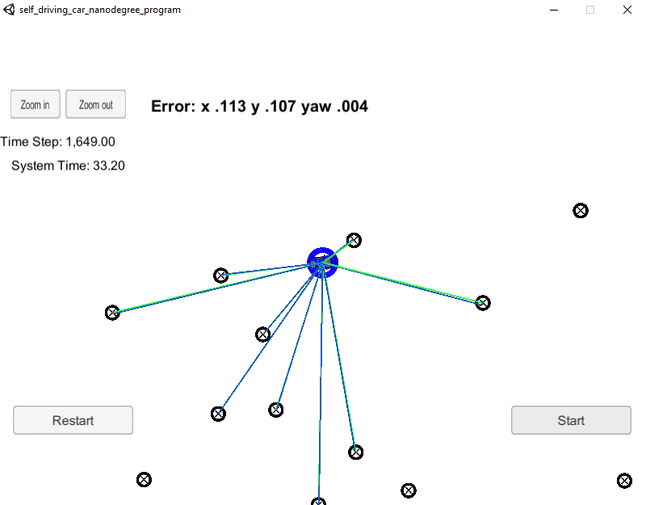

# CarND-Kidnapped-Vehicle-P3
Udacity Self-Driving Car Nanodegree - Particle Filter Project 

# Overview
In this project, I used a two-dimensional particle filter to help localize a car placed in an somewhat unknown location. I started with a less accurate map data similar to GPS data to initialize car's location. Then in the prediction step I used the velocity and yaw (turn) rate. In the update step I have transformed the sensor observation points which are in car coordinate system into my map coordinates, then associated these observations with the landmark on the map. Then I tried to fiure out the likelihood that a given particle made those observation. 

The particles were then re-sampled based on how likely a given particle was to have made the observations of the landmarks, which helps to more accurately localize the vehicle.

## Project Steps

All steps are within 'particle_filter.cpp' in the 'src' folder

    Initialization function (estimate position from GPS data using particle filters, add random noise)
    Prediction function (predict position based on adding velocity and yaw rate to particle filters, add random noise)
    Update Weights function - Transformation of observation points to map coordinates (given in vehicle coordinates)
    Update Weights function - Association of landmarks to the transformed observation points
    Update Weights function - Calculation of multi-variate Gaussian distribution
    Resample function - Resamples particles, with replacement occurring based on weighting distributions

# Prerequisites

The project has the following dependencies (from Udacity's seed project):

- cmake >= 3.5
- make >= 4.1
- gcc/g++ >= 5.4
- Udacity's simulator.

# Compiling and executing the project

These are the suggested steps:

1. mkdir build
2. cd build
3. cmake ..
4. make
5. ./particle_filter

Alternatively some scripts have been included to streamline this process, these can be leveraged by executing the following in the top directory of the project:

1. ./clean.sh
2. ./build.sh
3. ./run.sh

## Inputs to the Particle Filter
Inputs to the particle filter are in the `data` directory.

#### The Map*
`map_data.txt` includes the position of landmarks (in meters) on an arbitrary Cartesian coordinate system. Each row has three columns
1. x position
2. y position
3. landmark id

#### All other data the simulator provides, such as observations and controls.

## Results

Particle filter implemented was run on Udacity's simulator and its error and performance was noted. Below are the results with 100 particles. Error below is cumulative mean weighted error.

    Runtime: 49.06 seconds
    
| Estimation    | Error         | 
| ------------- |:-------------:| 
| x             | 0.113         | 
| y             | 0.109         | 
| yaw           | 0.004         | 

    
## Visualizing the Car's Localization based on Landmark Observations

The green lines below are the car's observations of surrounding landmarks. The blue lines are the observations from the predicted car location. As can be seen from the picture that those two lines are almost overlapped meaning that the predicted location is very close to the actual car location.

